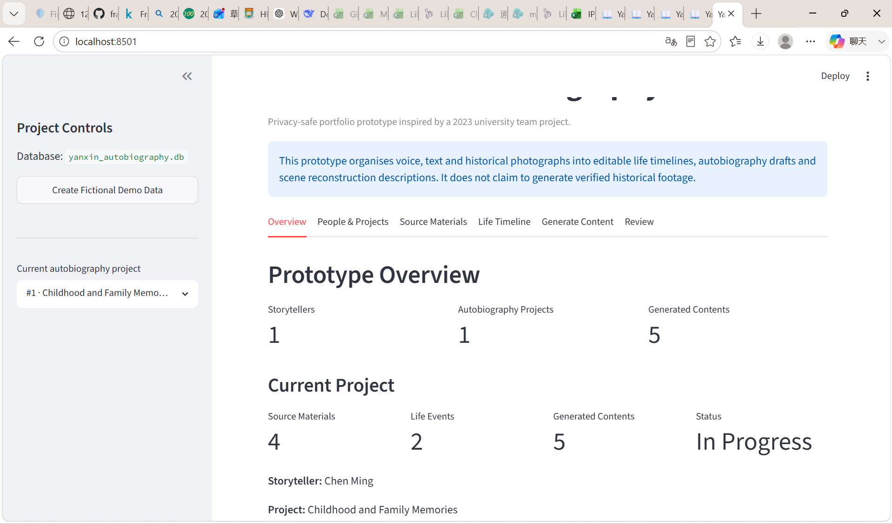
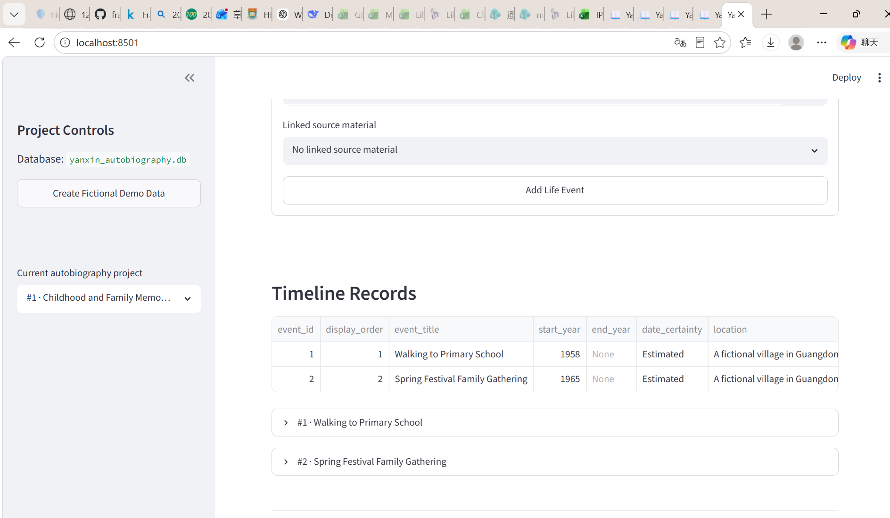
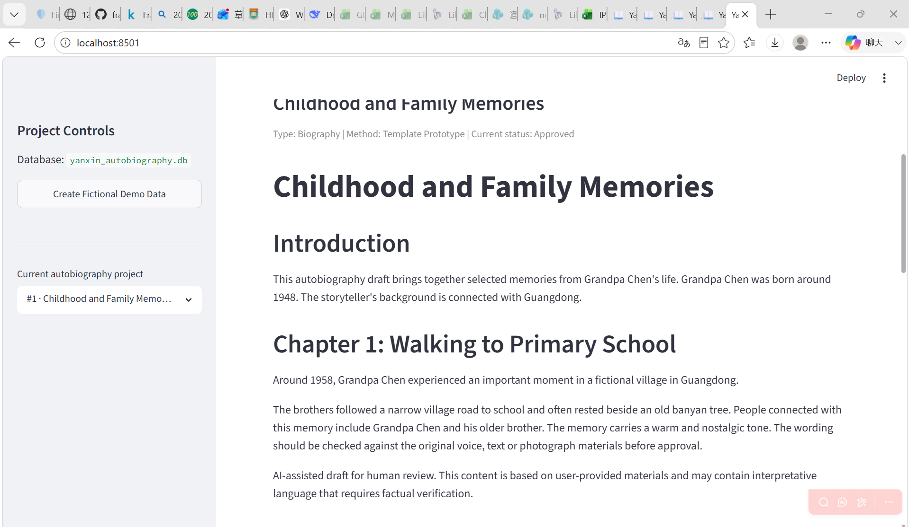
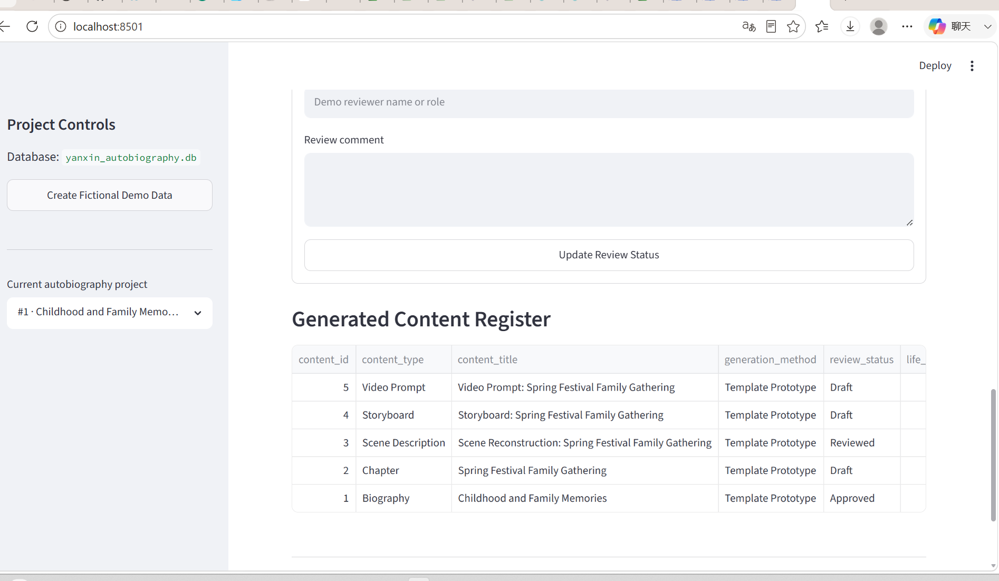
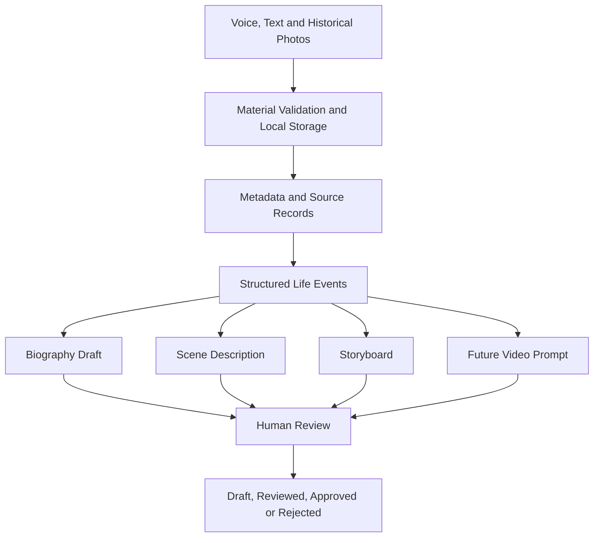
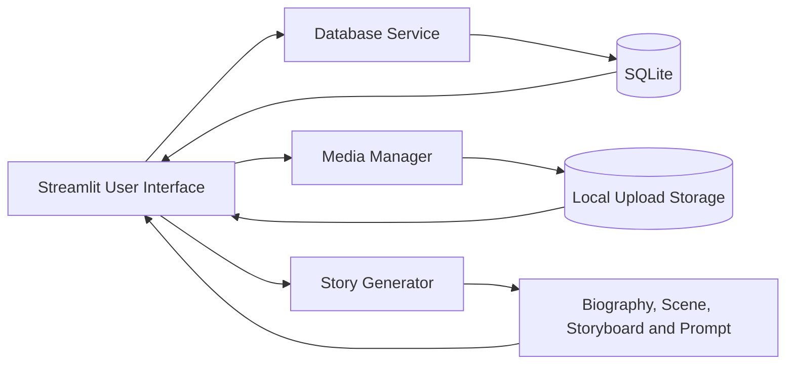

# Yanxin AI Oral Autobiography Platform

A privacy-safe, locally runnable prototype that organises written memories, voice recordings and historical photographs into structured life timelines, editable autobiography drafts, scene reconstruction descriptions, storyboards and future video-generation prompts.

> This repository is a reconstructed portfolio prototype inspired by a 2023 university team project. It does not contain the original private codebase or real personal data.

---

## Project Overview

Many personal and family histories are fragmented across conversations, handwritten notes, voice recordings and old photographs. The Yanxin prototype demonstrates how these materials can be organised into a structured oral-autobiography workflow while keeping users responsible for factual review.

The current prototype supports:

- storyteller profile creation;
- autobiography project management;
- written memory input;
- historical photo and audio upload;
- source-material metadata management;
- structured life-event timelines;
- template-based biography generation;
- scene reconstruction descriptions;
- five-shot storyboards;
- future video-generation prompts;
- human review and approval statuses;
- local SQLite persistence.

The prototype deliberately does **not** claim to generate verified historical footage or to train a production Transformer model.

---

## Demo Dashboard

### Project Overview



### Structured Life Timeline



### Approved Biography Draft



### Generated Content Review Register



---

## End-to-End Workflow



---

## System Architecture



### Main Components

| Component | Responsibility |
|---|---|
| `app/dashboard.py` | Streamlit interface and end-to-end user workflow |
| `app/services/database.py` | SQLite connection, inserts, queries and review status updates |
| `app/services/media_manager.py` | File validation, unique filenames, upload storage and safe deletion |
| `app/services/story_generator.py` | Template-based biography, chapter, scene, storyboard and prompt generation |
| `sql/schema.sql` | Relational database schema and indexes |
| `scripts/rebuild_clean_demo.py` | Rebuilds a clean, fictional demonstration dataset |
| `scripts/test_*.py` | Service-level validation scripts |

---

## Database Design

The SQLite schema contains six main tables:

1. `storytellers`
2. `autobiography_projects`
3. `source_materials`
4. `life_events`
5. `generated_contents`
6. `content_reviews`

Relationship summary:

```text
Storyteller
    └── Autobiography Project
            ├── Source Materials
            ├── Life Events
            │       └── Generated Contents
            └── Content Review History
```

Foreign-key rules keep project records connected while allowing source materials to be detached safely when required.

---

## Technology Stack

- **Language:** Python
- **Frontend:** Streamlit
- **Database:** SQLite
- **Data handling:** Pandas
- **Image validation:** Pillow
- **Storage:** Local filesystem
- **Documentation:** Markdown and Mermaid
- **Testing:** Python service-level test scripts

---

## Repository Structure

```text
yanxin-ai-oral-autobiography-platform/
├── app/
│   ├── dashboard.py
│   └── services/
│       ├── database.py
│       ├── media_manager.py
│       └── story_generator.py
├── data/
│   ├── sample/
│   └── uploads/
├── diagrams/
│   └── screenshots/
├── docs/
│   ├── product_requirements.md
│   ├── role_and_contributions.md
│   ├── technical_constraints.md
│   └── user_journey.md
├── outputs/
├── scripts/
│   ├── rebuild_clean_demo.py
│   ├── test_database_service.py
│   ├── test_dashboard_dependencies.py
│   ├── test_media_manager.py
│   └── test_story_generator.py
├── sql/
│   └── schema.sql
├── .gitignore
├── README.md
└── requirements.txt
```

Local databases and user uploads are excluded from Git.

---

## Quick Start

### 1. Create and activate a virtual environment

```powershell
python -m venv .venv
.\.venv\Scripts\Activate.ps1
```

### 2. Install dependencies

```powershell
python -m pip install -r requirements.txt
```

### 3. Create a clean fictional demo

```powershell
python -m scripts.rebuild_clean_demo
```

### 4. Start the application

```powershell
python -m streamlit run app/dashboard.py
```

Open:

```text
http://localhost:8501
```

---

## Validation Commands

Run the service tests from the project root:

```powershell
python -m scripts.test_database_service
python -m scripts.test_media_manager
python -m scripts.test_story_generator
python -m scripts.test_dashboard_dependencies
```

Successful runs should end with messages such as:

```text
Database service test completed successfully.
Media manager test completed successfully.
All story generator assertions passed.
Dashboard dependency test completed successfully.
```

---

## Clean Demo Dataset

The rebuild script creates a fully fictional and privacy-safe dataset:

- **1** storyteller;
- **1** autobiography project;
- **4** source materials;
- **2** life events;
- **5** generated contents.

Review states:

| Content type | Status |
|---|---|
| Biography | Approved |
| Chapter | Draft |
| Scene Description | Reviewed |
| Storyboard | Draft |
| Video Prompt | Draft |

The script backs up the current local database and upload directory before rebuilding the demo.

---

## Product and AI Boundaries

The current implementation uses a transparent, deterministic template generator rather than a hidden production model.

This choice makes the prototype:

- runnable without API keys;
- easy to test locally;
- honest about its current AI maturity;
- suitable for demonstrating product workflow and system design.

Potential future integrations include:

- speech-to-text transcription;
- named-entity and event extraction;
- multilingual biography generation;
- retrieval-grounded historical context;
- optional LLM-assisted rewriting;
- document export;
- cloud storage with authentication;
- consent and data-deletion workflows.

---

## Privacy, Accuracy and Ethics

Oral autobiographies may include names, faces, voices, family relationships, locations and sensitive memories. A production implementation would require:

- informed consent;
- authentication and access control;
- encrypted storage;
- secure deletion and data export;
- clear AI-generated content labels;
- copyright and portrait-right review;
- links between generated statements and source materials;
- human factual approval.

This public repository uses fictional demo records and excludes local uploads and database files from version control.

---

## My Role and Contribution

My primary role in the original university project was **Project Coordinator and Product–Technical Liaison**.

My contributions included:

- translating business ideas into functional and technical requirements;
- communicating technical feasibility and limitations back to commercial participants;
- supporting cross-functional coordination and scope prioritisation;
- participating in selected frontend workflows;
- contributing to basic database-related implementation and discussions;
- reviewing whether AI-assisted outputs matched the intended user experience.

I do **not** claim to have independently trained the original Transformer models or developed the entire original system.

For this public portfolio reconstruction, I implemented the Streamlit prototype, SQLite workflow, media-management service, template-based content generator, documentation and test scripts.

More detail is available in [`docs/role_and_contributions.md`](docs/role_and_contributions.md).

---

## Interview Summary

A concise explanation of the project:

> I reconstructed a privacy-safe prototype of an AI-assisted oral autobiography platform using Streamlit, SQLite and Python. The system accepts text, photo and audio materials, organises them into structured life events, generates editable biography chapters and scene/storyboard drafts, and stores each output within a human review workflow. My original team role focused on product–technical coordination, while this repository demonstrates my independent ability to translate the concept into a runnable prototype.

---

## Limitations

- Audio files are stored but not automatically transcribed.
- Photo content is not automatically interpreted.
- Story generation is template-based.
- Historical facts are not automatically verified.
- The prototype is local and does not include production authentication.
- Video prompts are generated, but no video is rendered.
- Editing and deletion functions are intentionally limited in Version 1.

---

## Disclaimer

All demo names, memories, photographs and recordings in this repository are fictional. Generated scene descriptions are interpretative drafts and must not be treated as authentic historical evidence.
