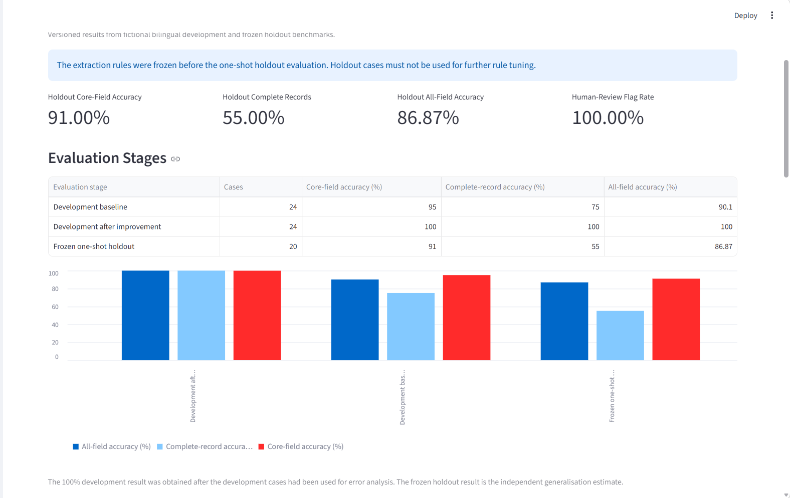
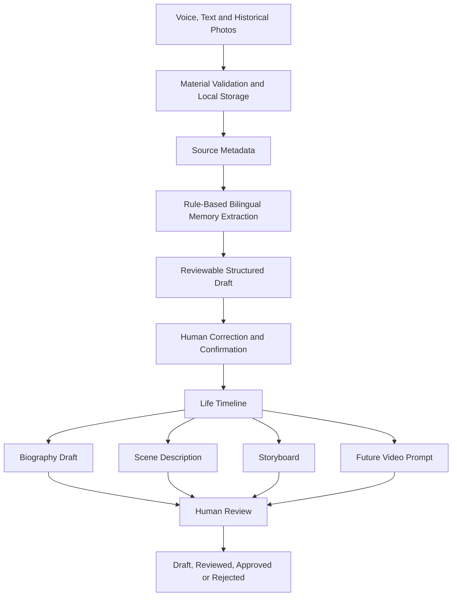
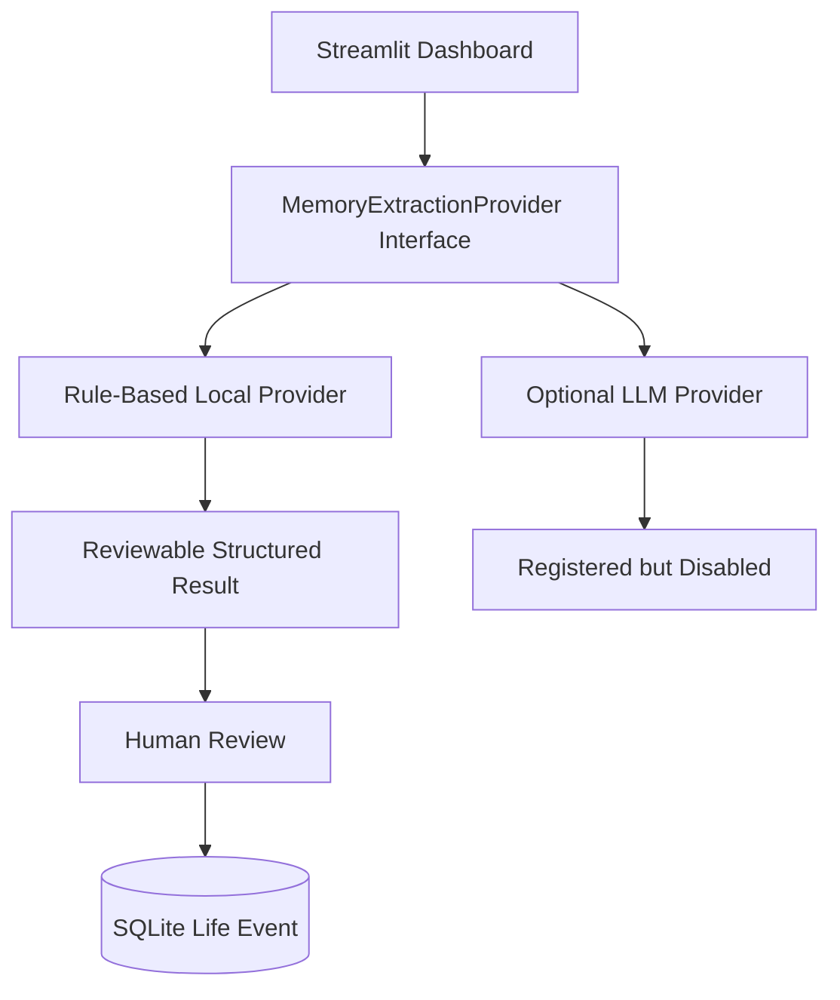
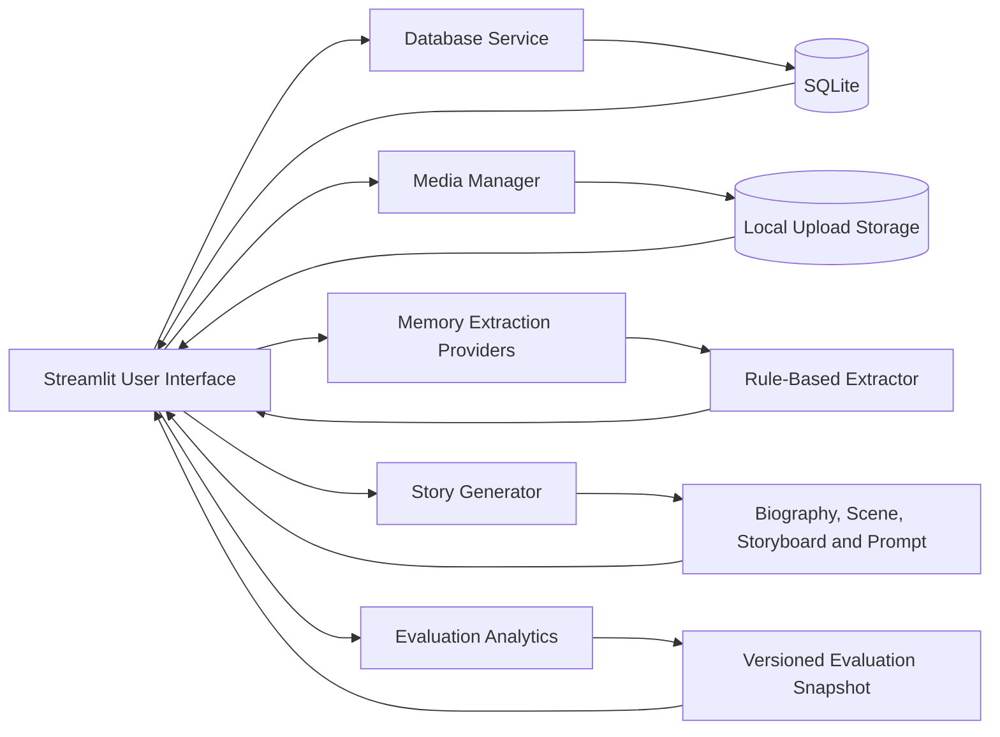

# Yanxin AI Oral Autobiography Platform

A privacy-aware, locally runnable portfolio prototype that transforms written memories, voice recordings and historical photographs into reviewable life events, editable autobiography drafts, scene reconstructions, storyboards and future video-generation prompts.

> This repository is a reconstructed portfolio project inspired by a 2023 university team project. It does not contain the original private codebase, production models or real personal data.

---

## Project Highlights

- End-to-end Streamlit workflow for oral-history collection and review
- Local SQLite persistence and file storage
- Bilingual Chinese–English memory extraction
- Human-in-the-loop review before life events are saved
- Pluggable extraction-provider architecture
- Rule-based local mode with no external data transfer
- Development benchmark, frozen holdout benchmark and error analysis
- Evaluation Analytics dashboard
- Template-based biography, chapter, scene, storyboard and video-prompt generation
- Privacy, provenance and review-status controls

### Independent Holdout Result

After freezing the extraction rules, the prototype was evaluated once on 20 unseen fictional bilingual cases:

| Metric | Holdout result |
|---|---:|
| Core-field micro accuracy | **91.00%** |
| Core complete-record accuracy | **55.00%** |
| All-field micro accuracy | **86.87%** |
| Language detection accuracy | **100.00%** |
| Human-review flag rate | **100.00%** |

The holdout result is the main generalisation estimate. The 100% development-set result was obtained after those development cases had already been used for error analysis and rule improvement.

---

## Project Overview

Family histories are often fragmented across conversations, handwritten notes, voice recordings and old photographs. Yanxin demonstrates how those materials can be organised into a structured oral-autobiography workflow while keeping users responsible for factual verification.

The platform supports:

- storyteller profile creation;
- autobiography project management;
- written memory input;
- photo and audio upload;
- source-material metadata;
- bilingual memory extraction;
- reviewable structured life events;
- editable life timelines;
- template-based biography generation;
- scene reconstruction descriptions;
- five-shot storyboards;
- future video-generation prompts;
- review statuses such as Draft, Reviewed, Approved and Rejected;
- evaluation analytics;
- local SQLite persistence.

The platform deliberately does **not** claim to:

- generate verified historical footage;
- automatically confirm personal facts;
- train a production Transformer model;
- achieve production-level extraction accuracy;
- send memories to an external AI service in the default workflow.

---

## Demo Dashboard

### Project Overview


### Structured Life Timeline


### Approved Biography Draft


### Generated Content Review Register


### Evaluation Analytics


---

## End-to-End Product Workflow



---

## Memory Extraction Workflow

The local extraction workflow converts one Chinese or English memory passage into:

- detected language;
- event title;
- start and end year;
- date certainty;
- location;
- people involved;
- emotional tone;
- field-level confidence;
- review warnings.

Example:

```text
Input:
大约在1976年，我和母亲从广州搬到深圳。
虽然生活辛苦，但我们对新生活充满希望。

Output draft:
Title: 搬到深圳
Year: 1976
Location: 广州 → 深圳
People: 讲述者和母亲
Emotion: 艰难但充满希望
Review required: True
```

The extracted result is never saved automatically. The user must review and edit the draft before creating a life-event record.

---

## Extraction Provider Architecture



Current provider behaviour:

| Provider | Availability | External transfer | Purpose |
|---|---|---:|---|
| Rule-based demo mode | Available | No | Local, deterministic portfolio baseline |
| LLM enhanced mode | Registered but disabled | Not used | Future extensibility only |

The optional provider interface demonstrates extensibility without requiring API keys or adding unnecessary model complexity to the public prototype.

---

## Evaluation Methodology

### Development Benchmark

The development benchmark contains:

- 24 fictional cases;
- 12 Chinese cases;
- 12 English cases;
- easy, medium and hard examples;
- manually labelled target fields.

It was used for:

1. baseline measurement;
2. error analysis;
3. targeted rule improvement;
4. regression testing.

#### Baseline

| Metric | Result |
|---|---:|
| Core-field micro accuracy | 95.00% |
| Core complete-record accuracy | 75.00% |
| All-field micro accuracy | 90.10% |
| Event-title accuracy | 45.83% |
| Location accuracy | 75.00% |

The main error categories were:

- title compression;
- location-boundary extraction.

#### Development Result After Improvement

| Metric | Result |
|---|---:|
| Core-field micro accuracy | 100.00% |
| Core complete-record accuracy | 100.00% |
| All-field micro accuracy | 100.00% |

This result is not presented as an independent test result because the development cases were used during rule refinement.

### Frozen One-Shot Holdout

The separate holdout benchmark contains:

- 20 unseen fictional cases;
- 10 Chinese cases;
- 10 English cases;
- no exact text overlap with the development benchmark;
- labels frozen before evaluation.

Evaluation controls:

```text
Frozen extraction-rule commit: 0169ccd
Holdout dataset SHA-256:
6bab95361b099280fa994ddca6cf2b13f265f11e5399feca5a5a36d4794cb47e
One-shot protocol: true
Do not tune on holdout: true
```

### Holdout Field Results

| Field | Accuracy |
|---|---:|
| Detected language | 100.00% |
| Event title | 40.00% |
| Date certainty | 100.00% |
| Start year | 100.00% |
| End year | 100.00% |
| Location | 70.00% |
| People involved | 90.00% |
| Emotional tone | 95.00% |

### Holdout Language Results

| Language | Cases | Core-field accuracy | Complete-record accuracy | All-field accuracy |
|---|---:|---:|---:|---:|
| English | 10 | 94.00% | 70.00% | 88.75% |
| Chinese | 10 | 88.00% | 40.00% | 85.00% |

The current evidence suggests that explicit years generalise well, while title compression and location boundaries remain the main weaknesses. These findings support the mandatory human-review workflow.

Detailed methodology and limitations are documented in:

[`docs/02_memory_extraction_evaluation.md`](docs/02_memory_extraction_evaluation.md)

---

## Evaluation Analytics Dashboard

The Streamlit dashboard contains an **Evaluation Analytics** tab that displays:

- development baseline;
- development result after rule improvement;
- frozen holdout result;
- field-level accuracy;
- error count by field;
- Chinese–English comparison;
- governance metadata;
- frozen commit and dataset hash;
- limitations and interpretation.

The dashboard reads from a versioned evaluation snapshot:

```text
data/evaluation/memory_extraction_evaluation_snapshot.json
```

This keeps the display logic separate from the evaluation artefacts and makes the portfolio result reproducible.

---

## System Architecture



### Main Components

| Component | Responsibility |
|---|---|
| `app/dashboard.py` | Streamlit interface and end-to-end workflow |
| `app/services/database.py` | SQLite inserts, queries and review-status updates |
| `app/services/media_manager.py` | File validation, local storage and safe deletion |
| `app/services/memory_extractor.py` | Deterministic bilingual field extraction |
| `app/services/memory_extraction_providers.py` | Provider abstraction and availability controls |
| `app/services/story_generator.py` | Biography, chapter, scene, storyboard and prompt generation |
| `data/evaluation/` | Development benchmark, frozen holdout and analytics snapshot |
| `scripts/evaluate_memory_extractor.py` | Development benchmark evaluation |
| `scripts/evaluate_memory_extractor_holdout.py` | One-shot frozen holdout evaluation |
| `scripts/test_*.py` | Regression, integrity and service validation |
| `sql/schema.sql` | Relational schema and indexes |

---

## Database Design

The SQLite schema contains six main tables:

1. `storytellers`
2. `autobiography_projects`
3. `source_materials`
4. `life_events`
5. `generated_contents`
6. `content_reviews`

Relationship summary:

```text
Storyteller
    └── Autobiography Project
            ├── Source Materials
            ├── Life Events
            │       └── Generated Contents
            └── Content Review History
```

Source provenance is preserved through the optional link between a life event and its source material.

---

## Technology Stack

- **Language:** Python
- **Frontend:** Streamlit
- **Database:** SQLite
- **Data handling:** Pandas
- **Image validation:** Pillow
- **Storage:** Local filesystem
- **Documentation:** Markdown and Mermaid
- **Evaluation:** Custom Python benchmark scripts
- **Testing:** Python regression and service-level scripts
- **Version control:** Git and GitHub

---

## Repository Structure

```text
yanxin-ai-oral-autobiography-platform/
├── app/
│   ├── dashboard.py
│   └── services/
│       ├── database.py
│       ├── media_manager.py
│       ├── memory_extractor.py
│       ├── memory_extraction_providers.py
│       └── story_generator.py
├── data/
│   ├── evaluation/
│   │   ├── memory_extraction_cases.json
│   │   ├── memory_extraction_holdout_cases.json
│   │   └── memory_extraction_evaluation_snapshot.json
│   ├── sample/
│   └── uploads/
├── diagrams/
│   └── screenshots/
├── docs/
│   ├── 02_memory_extraction_evaluation.md
│   ├── product_requirements.md
│   ├── role_and_contributions.md
│   ├── technical_constraints.md
│   └── user_journey.md
├── outputs/
│   └── evaluation/
├── scripts/
│   ├── evaluate_memory_extractor.py
│   ├── evaluate_memory_extractor_holdout.py
│   ├── rebuild_clean_demo.py
│   ├── test_dashboard_evaluation_analytics.py
│   ├── test_memory_extraction_providers.py
│   ├── test_memory_extractor.py
│   ├── test_memory_extractor_evaluation.py
│   ├── test_memory_extractor_holdout.py
│   └── other service tests
├── sql/
│   └── schema.sql
├── .gitignore
├── README.md
└── requirements.txt
```

Local databases, uploads and generated evaluation outputs are excluded from Git where appropriate.

---

## Quick Start

### 1. Create and activate a virtual environment

```powershell
python -m venv .venv
.\.venv\Scripts\Activate.ps1
```

### 2. Install dependencies

```powershell
python -m pip install -r requirements.txt
```

### 3. Create a clean fictional demo

```powershell
python -m scripts.rebuild_clean_demo
```

### 4. Start the application

```powershell
python -m streamlit run app/dashboard.py
```

Open:

```text
http://localhost:8501
```

---

## Validation Commands

### Core Services

```powershell
python -m scripts.test_database_service
python -m scripts.test_media_manager
python -m scripts.test_story_generator
python -m scripts.test_dashboard_dependencies
```

### Memory Extraction

```powershell
python -m scripts.test_memory_extractor
python -m scripts.test_memory_extraction_providers
```

### Development Evaluation

```powershell
python -m scripts.evaluate_memory_extractor
python -m scripts.test_memory_extractor_evaluation
```

### Frozen Holdout

```powershell
python -m scripts.test_memory_extractor_holdout
python -m scripts.evaluate_memory_extractor_holdout
```

### Evaluation Analytics

```powershell
python -m scripts.test_dashboard_evaluation_analytics
```

Successful test runs should end with messages such as:

```text
Language-aware memory extractor test completed successfully.
All provider architecture assertions passed.
Dataset integrity, metrics and output files all passed.
Analytics tab, frozen snapshot and governance assertions passed.
```

---

## Clean Demo Dataset

The rebuild script creates a fictional and privacy-safe demonstration dataset:

- **1** storyteller;
- **1** autobiography project;
- **4** source materials;
- **2** life events;
- **5** generated contents.

Review states:

| Content type | Status |
|---|---|
| Biography | Approved |
| Chapter | Draft |
| Scene Description | Reviewed |
| Storyboard | Draft |
| Video Prompt | Draft |

The script backs up the current local database and upload directory before rebuilding the demo.

---

## Privacy, Accuracy and Human Review

Oral autobiographies may include names, faces, voices, relationships, locations and sensitive memories. The public prototype therefore applies these controls:

- local-first storage;
- fictional public-demo data;
- no automatic factual approval;
- human confirmation before saving extracted events;
- review statuses for generated content;
- visible AI-assistance notices;
- links between generated content and source records where available;
- no active external LLM provider;
- no claim that generated scenes are historical evidence.

A production implementation would additionally require:

- authentication and role-based access;
- encryption at rest and in transit;
- informed consent;
- secure deletion and export;
- audit logs;
- retention policies;
- copyright and portrait-right review;
- stronger provenance and factual-verification workflows.

---

## Product and AI Boundaries

The current implementation combines:

- deterministic rule-based extraction;
- local structured-data workflows;
- template-based content generation;
- human review.

This design keeps the prototype:

- runnable without API keys;
- explainable;
- testable;
- privacy-aware;
- appropriate for a public portfolio.

Potential future work includes:

- speech-to-text transcription;
- photo metadata extraction;
- multilingual entity extraction;
- retrieval-grounded historical context;
- document export;
- role-based permissions;
- consent and deletion workflows;
- optional LLM-assisted rewriting;
- a new development benchmark for future rule versions.

The frozen holdout set will not be reused for future tuning.

---

## My Role and Contribution

My primary role in the original university project was **Project Coordinator and Product–Technical Liaison**.

My contributions included:

- translating business ideas into functional and technical requirements;
- communicating feasibility and limitations to commercial participants;
- supporting scope prioritisation and cross-functional coordination;
- participating in selected frontend workflows;
- contributing to basic database implementation and discussion;
- reviewing whether AI-assisted outputs matched the intended user experience.

I do **not** claim to have independently trained the original Transformer models or built the original system alone.

For this public portfolio reconstruction, I independently implemented:

- the Streamlit prototype;
- SQLite data workflows;
- media-management service;
- bilingual memory extraction;
- provider architecture;
- human-review workflow;
- evaluation benchmarks;
- error analysis;
- frozen holdout protocol;
- Analytics dashboard;
- documentation and regression tests.

More detail is available in:

[`docs/role_and_contributions.md`](docs/role_and_contributions.md)

---

## Interview Summary

> I reconstructed a privacy-aware oral-autobiography platform using Python, Streamlit and SQLite. The system organises text, photo and audio materials, extracts bilingual life-event fields into a human-review workflow, and generates editable biography and scene drafts. I built a 24-case development benchmark for error analysis, froze the rules, and then ran a one-shot evaluation on 20 unseen fictional cases, achieving 91% core-field micro accuracy and 55% complete-record accuracy. The evaluation showed that years generalised well, while title compression and location boundaries still required human review.

---

## Limitations

- All benchmark and demonstration records are fictional.
- The development benchmark contains only 24 cases.
- The frozen holdout contains only 20 cases.
- Strict string matching can mark semantically similar titles as incorrect.
- Audio files are stored but not automatically transcribed.
- Photo content is not automatically interpreted.
- Story generation is template-based.
- Historical facts are not automatically verified.
- The prototype does not include production authentication.
- No production user study has been conducted.
- Video prompts are generated, but no video is rendered.
- The frozen holdout cannot be reused for future rule tuning.

---

## Disclaimer

All names, memories, photographs and recordings used in the public repository are fictional. Generated text and scene descriptions are interpretative drafts and must not be treated as verified historical evidence.
